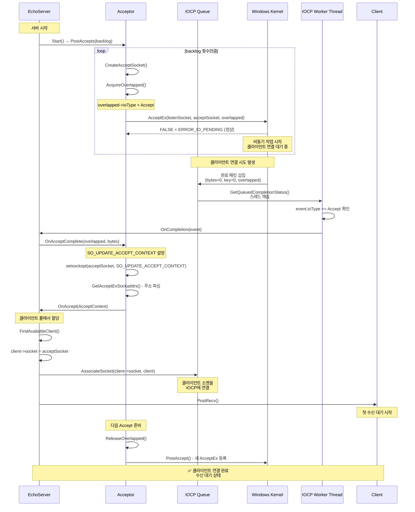
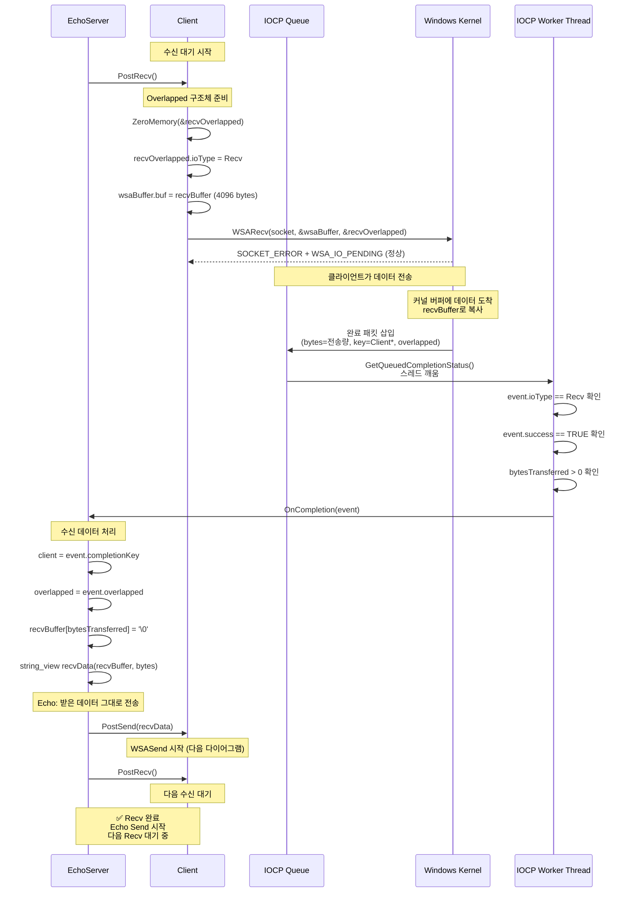
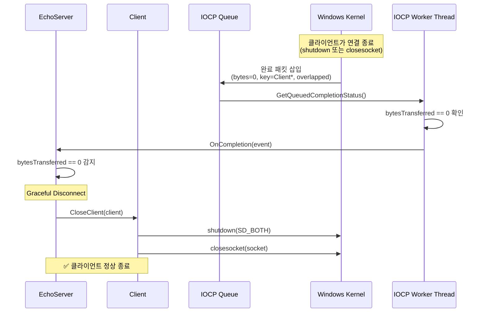
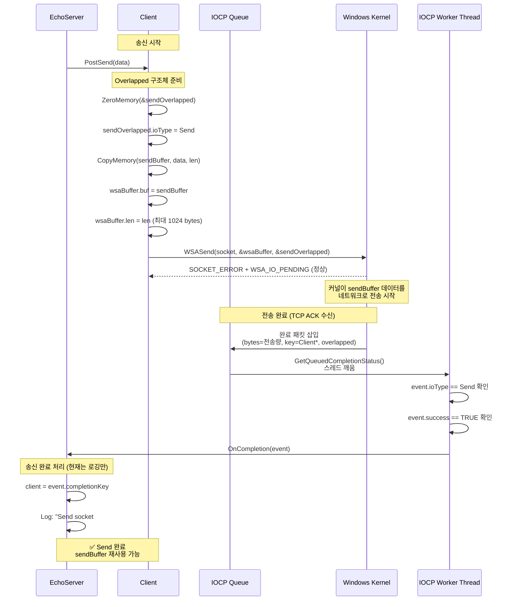
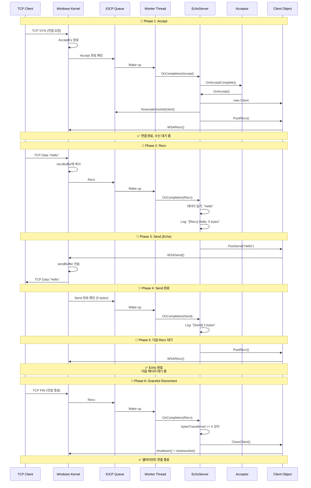
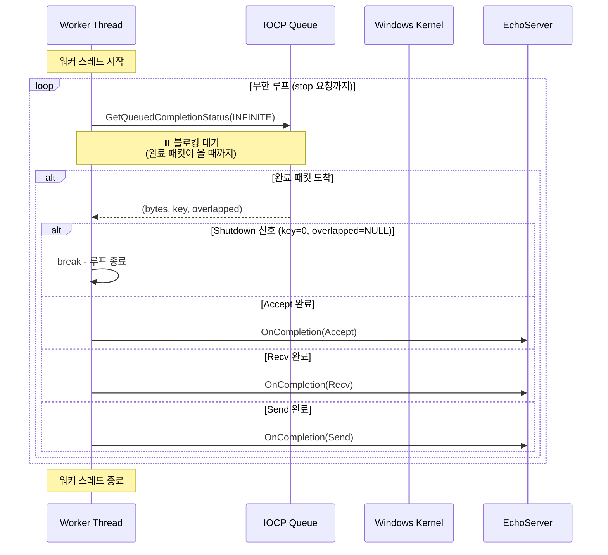
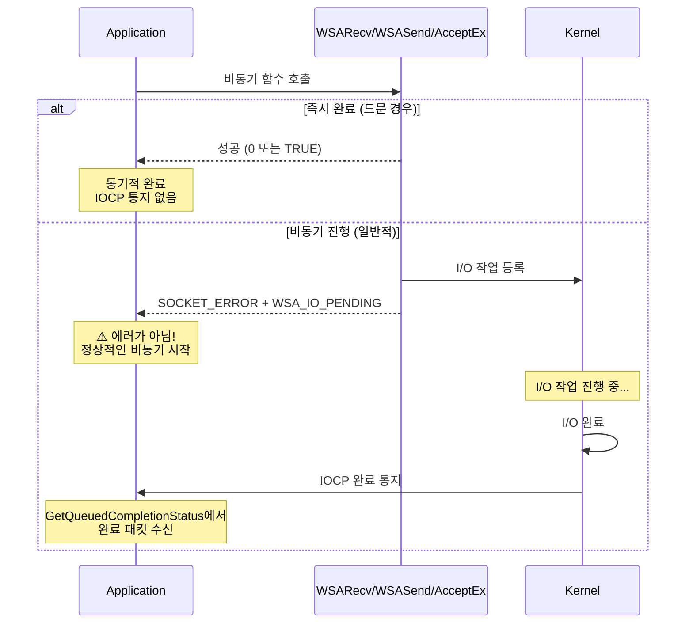
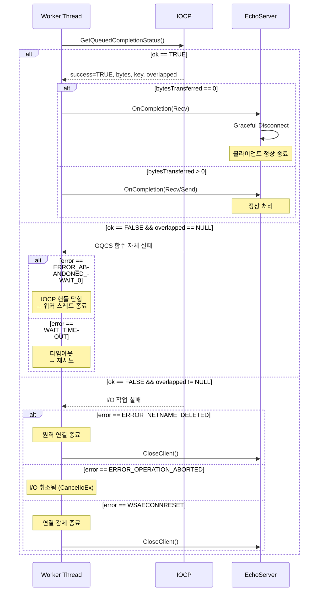

# IOCP 실행 흐름 Sequence Diagrams

**프로젝트**: highp-mmorpg Echo Server
**작성일**: 2026-01-20
**목적**: AcceptEx, WSARecv, WSASend의 비동기 실행 흐름 시각화

---

## 📚 목차

1. [Accept 흐름](#1-accept-흐름)
2. [Recv 흐름](#2-recv-흐름)
3. [Send 흐름](#3-send-흐름)
4. [전체 Echo 사이클](#4-전체-echo-사이클)

---

## 1. Accept 흐름

### AcceptEx 비동기 연결 수락 프로세스



### 코드 경로
```
EchoServer::Start() [EchoServer.cpp:22]
  └─> Acceptor::PostAccepts() [Acceptor.cpp:146]
      └─> Acceptor::PostAccept() [Acceptor.cpp:104]
          └─> AcceptEx() [Acceptor.cpp:123]

IOCP Worker Thread
  └─> GetQueuedCompletionStatus() [IoCompletionPort.cpp:100]
      └─> OnCompletion() [IoCompletionPort.cpp:124]
          └─> EchoServer::OnCompletion() [EchoServer.cpp:74]
              └─> Acceptor::OnAcceptComplete() [Acceptor.cpp:156]
                  └─> EchoServer::OnAccept() [EchoServer.cpp:128]
                      └─> Client::PostRecv() [Client.cpp:12]
```

---

## 2. Recv 흐름

### WSARecv 비동기 데이터 수신 프로세스



### 특수 케이스: Graceful Disconnect



### 코드 경로
```
Client::PostRecv() [Client.cpp:12]
  └─> WSARecv() [Client.cpp:22]

IOCP Worker Thread
  └─> GetQueuedCompletionStatus() [IoCompletionPort.cpp:100]
      └─> EchoServer::OnCompletion() [EchoServer.cpp:74]
          └─> case EIoType::Recv [EchoServer.cpp:86]
              ├─> Client::PostSend() [EchoServer.cpp:104]
              └─> Client::PostRecv() [EchoServer.cpp:109]
```

---

## 3. Send 흐름

### WSASend 비동기 데이터 송신 프로세스



### 코드 경로
```
Client::PostSend() [Client.cpp:38]
  └─> WSASend() [Client.cpp:50]

IOCP Worker Thread
  └─> GetQueuedCompletionStatus() [IoCompletionPort.cpp:100]
      └─> EchoServer::OnCompletion() [EchoServer.cpp:74]
          └─> case EIoType::Send [EchoServer.cpp:115]
              └─> 로깅만 수행
```

---

## 4. 전체 Echo 사이클

### 클라이언트 연결부터 Echo 응답까지 전체 흐름



---

## 5. IOCP Worker Thread 메인 루프

### WorkerLoop의 지속적인 완료 패킷 처리



---

## 6. 핵심 개념 정리

### 6.1 비동기 I/O의 ERROR_IO_PENDING



### 6.2 Overlapped 구조체의 역할

```
┌─────────────────────────────────────────┐
│ Client 객체                              │
├─────────────────────────────────────────┤
│ SOCKET socket                            │
│                                          │
│ OverlappedExt recvOverlapped ───────┐   │
│   ├─ WSAOVERLAPPED overlapped       │   │
│   ├─ EIoType ioType = Recv          │   │
│   ├─ char recvBuffer[4096]          │   │
│   └─ WSABUF wsaBuffer               │   │
│                                     │   │
│ OverlappedExt sendOverlapped ───────┼─┐ │
│   ├─ WSAOVERLAPPED overlapped       │ │ │
│   ├─ EIoType ioType = Send          │ │ │
│   ├─ char sendBuffer[1024]          │ │ │
│   └─ WSABUF wsaBuffer               │ │ │
└─────────────────────────────────────┼─┼─┘
                                      │ │
        WSARecv(..., &recvOverlapped) ┘ │
        WSASend(..., &sendOverlapped) ──┘
                      ↓
              Windows Kernel이
              overlapped 주소 기억
                      ↓
              I/O 완료 시
              IOCP 큐에 삽입
                      ↓
     GetQueuedCompletionStatus(&overlapped)
                      ↓
         (OverlappedExt*)overlapped
              ioType 확인!
```

### 6.3 CompletionKey의 역할

```
AssociateSocket(socket, client_ptr)
                    ↓
        client_ptr을 completionKey로 등록
                    ↓
       WSARecv/WSASend 호출 시
    커널이 completionKey를 기억
                    ↓
            I/O 완료 시
  IOCP에 completionKey 포함하여 통지
                    ↓
GetQueuedCompletionStatus(&completionKey)
                    ↓
    (Client*)completionKey
      Client 객체 복원!
```

---

## 7. 에러 처리 흐름

### GetQueuedCompletionStatus 에러 분기



---

## 8. 참고: 코드 위치

### 주요 파일 및 함수

| 컴포넌트 | 파일 경로 | 주요 함수 |
|---------|----------|----------|
| **EchoServer** | echo/echo-server/EchoServer.cpp | Start(), OnCompletion(), OnAccept() |
| **Acceptor** | network/Acceptor.cpp | PostAccept(), OnAcceptComplete() |
| **Client** | network/Client.cpp | PostRecv(), PostSend() |
| **IoCompletionPort** | network/IoCompletionPort.cpp | WorkerLoop(), Initialize() |
| **OverlappedExt** | network/OverlappedExt.h | 구조체 정의 |

### 주요 상수

| 상수 | 값 | 정의 위치 | 설명 |
|------|-----|----------|------|
| recvBufferSize | 4096 | network/Const.h | 수신 버퍼 크기 |
| sendBufferSize | 1024 | network/Const.h | 송신 버퍼 크기 |
| backlog | 설정값 | config.runtime.toml | 동시 Accept 개수 |
| maxWorkerThreadMultiplier | 설정값 | config.runtime.toml | 워커 스레드 배수 |

---

**문서 버전**: 1.0
**최종 수정**: 2026-01-20
**작성자**: Claude Code Analysis Team
