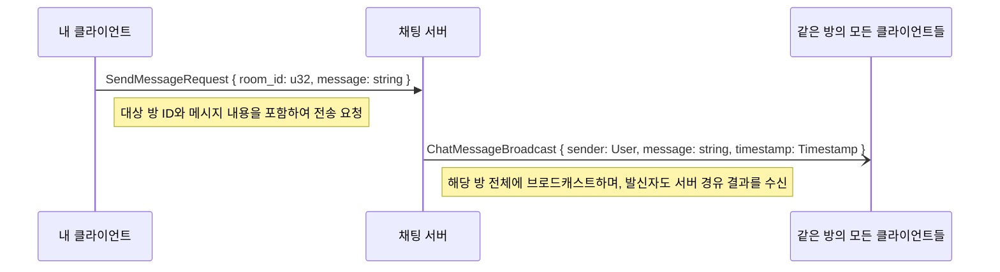

# ChatMessage 시퀀스 다이어그램

Client 가 채팅 메시지를 보내는 로직.

```mermaid
sequenceDiagram
    participant Client as 내 클라이언트
    participant Server as 채팅 서버
    participant Clients as 같은 방의 모든 클라이언트들

    Client->>Server: SendMessageRequest { room_id: u32, message: string }
    Note right of Client: 대상 방 ID와 메시지 내용을 포함하여 전송 요청

    Server-)Clients: ChatMessageBroadcast { sender: User, message: string, timestamp: Timestamp }
    Note right of Server: 해당 방 전체에 브로드캐스트하며, 발신자도 서버 경유 결과를 수신
```
