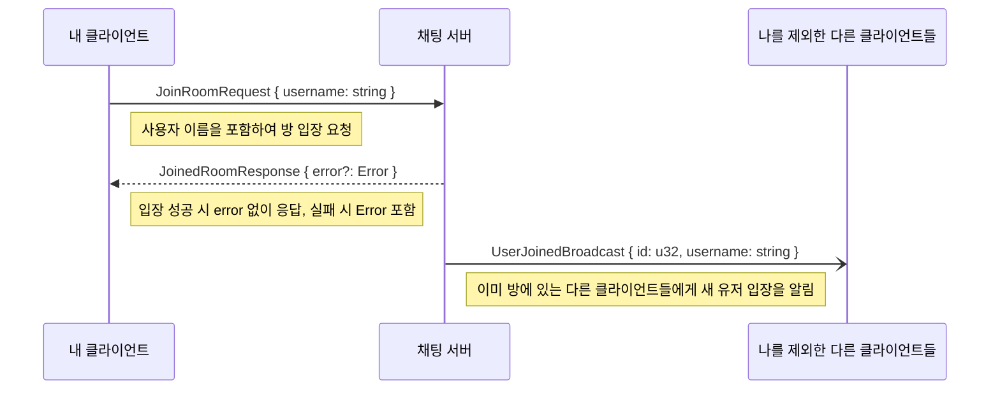

# JoinRoom 시퀀스 다이어그램

Client 가 채팅방에 입장하는 로직.

```mermaid
sequenceDiagram
    participant Client as 내 클라이언트
    participant Server as 채팅 서버
    participant Clients as 나를 제외한 다른 클라이언트들

    Client->>Server: JoinRoomRequest { username: string }
    Note right of Client: 사용자 이름을 포함하여 방 입장 요청

    Server-->>Client: JoinedRoomResponse { error?: Error }
    Note left of Server: 입장 성공 시 error 없이 응답, 실패 시 Error 포함

    Server-)Clients: UserJoinedBroadcast { id: u32, username: string }
    Note right of Server: 이미 방에 있는 다른 클라이언트들에게 새 유저 입장을 알림
```
