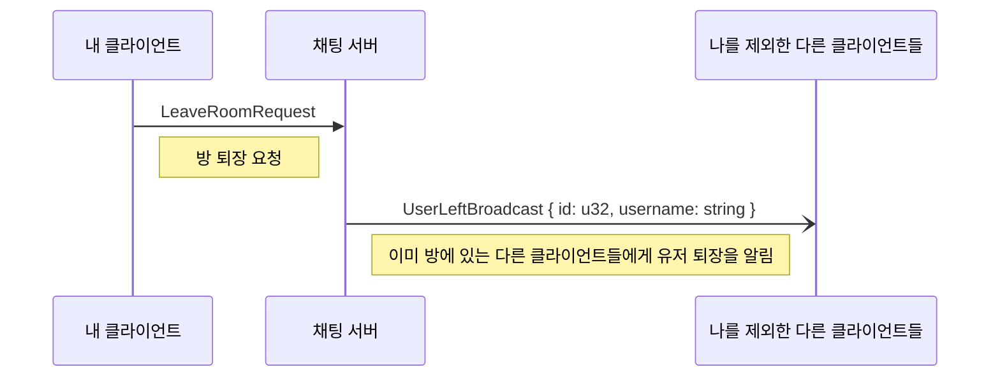

# LeaveRoom 시퀀스 다이어그램

Client 가 채팅방에서 떠나는 로직.

```mermaid
sequenceDiagram
    participant Client as 내 클라이언트
    participant Server as 채팅 서버
    participant Clients as 나를 제외한 다른 클라이언트들

    Client->>Server: LeaveRoomRequest
    Note right of Client: 방 퇴장 요청

    Server-)Clients: UserLeftBroadcast { id: u32, username: string }
    Note right of Server: 이미 방에 있는 다른 클라이언트들에게 유저 퇴장을 알림
```
